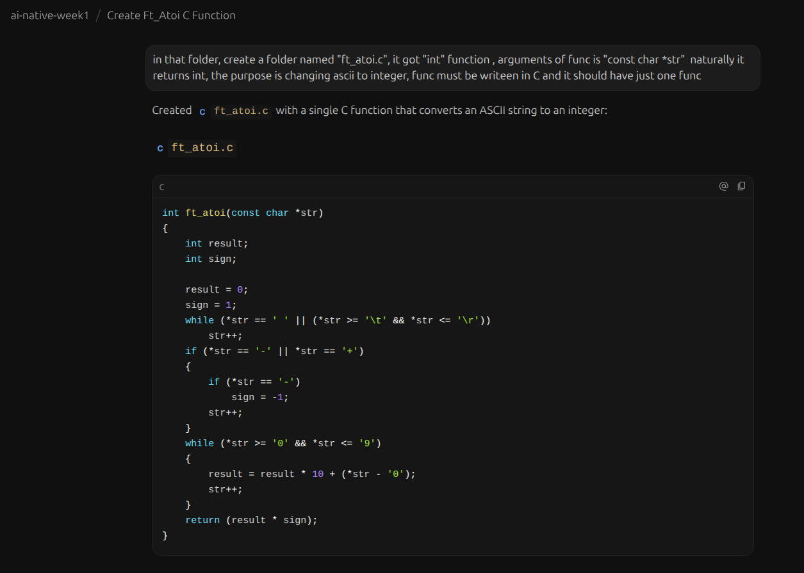

# ai-native-week1
its just a test repo for my augmented-ai lecture, i will test if my agent can work without a problem and i will prove its end-to-end
i used Antigravity + Gemini (2.0 / v2.17.0)

this is the prompt i gave it " in that folder, create a folder named "ft_atoi.c", it got "int" function , arguments of func is "const char *str"  naturally it returns int, the purpose is changing ascii to integer, func must be writeen in C and it should have just one func " and i did not need to modify it because it was perfectly working maybe because it was a basic convert func
as for the 3rd and final part working with ai agents truly amazing, this atoi func writed by me years ago and even if i try to write it with less memory i couldnt suceed more than this but this agent did it in a sec